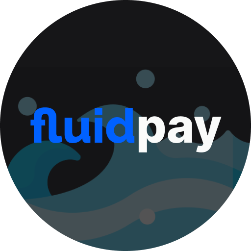

# 🌊 fluidpay

Fluidpay is a mobile-first web-app for p2p payments running on Base and USDC-centric, integrating an ERC-4337 smart account, stealth addresses and virtual cards to offer a seamless and secure experience.

## ⁉️ Description

Fluidpay propose USDC as the true native digital dollar, easing p2p payments on Base through smart accounts while maintaining privacy thanks to stealth addresses. The web-app allows to deposit money, share request links to get paid, send money in a click and creating multiple virtual cards with different features (e.g, automatic swap for any token received to USDC, automatic deposit on liquidity pools to earn interests). Moreover, users can connect their Gnosis Pay card, that they can fund directly from Base through a cross-chain transactions, so that they can spend their money IRL.

## 📦 How it's made?

This project is built on top of **Fluidkey**, a toolkit and infrastructure based on **Safe** smart accounts that allows to generate stealth addresses controlled by a single smart account. This feature allows the user to receive money on the same **ENS** that each time resolves to a different address. In this way nobody is able to reconstruct the user's balance as the stealth addresses are never linked with the main smart account.

We integrated also the new **Safe** smart accounts (v1.4) supporting ERC4337, so that we could sponsor transactions to users on **Base** through their paymaster and **Pimlico**.

To ease the onboarding experience, we included **Dynamic** in our Next.js project, so that users can decide the best sign-in method for them (e.g. email, socials, wallets).

Further down the line, we integrated **Chainlink** automation for our custom "virtual cards" (aka **Safe** smart accounts). Indeed we need those automation to perform the automatic swaps and deposits for liquidity providing on behalf of the user (for liquidity providing, we integrated with **Pancake Swap**). Moreover, each virtual card has it's own name and **ENS** subdomain so that users can easily share the sub-account of their choice whenever they want to receive a new payment.

Finally, we used the **Circle SDK** in order to mint reward NFTs to users whenever they reach certain expense goal with specific merchants, becoming eligible for special discounts.
